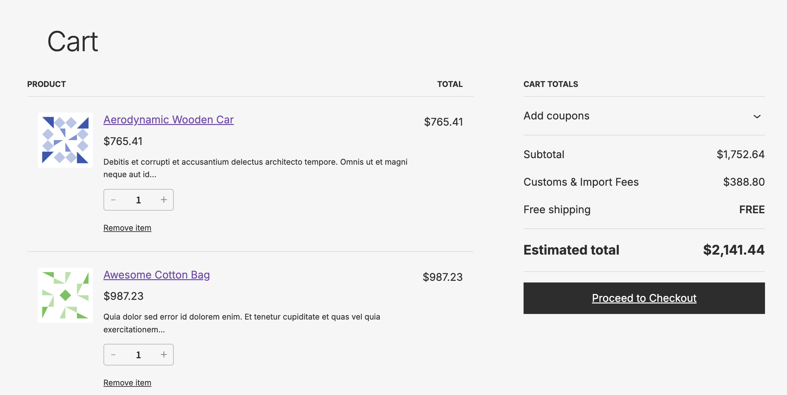
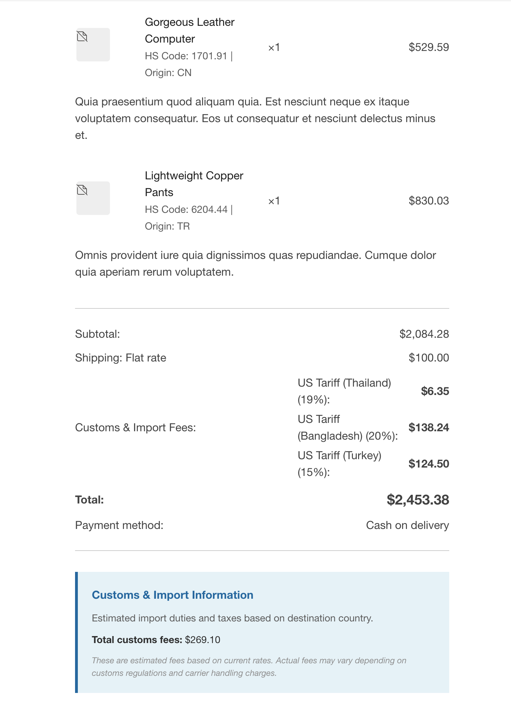

# Customs Fees for WooCommerce

Automatically calculate and display import duties, customs fees, and taxes for international WooCommerce orders.

Customs Fees for WooCommerce provides transparent international shipping cost calculations by automatically computing import duties, customs fees, and taxes during checkout. Your customers see the complete landed cost upfront, eliminating surprise fees at delivery and reducing cart abandonment.

## Purpose

With the U.S. ending its de minimis exemption on **August 29, 2025**, all international shipments will require customs duties regardless of value. This plugin helps merchants:

- **Add transparency** to international orders.
- **Prevent cart abandonment** from

## Features

### Core Functionality

- **Automated Fee Calculation**: Calculate customs fees based on percentage or flat rates.
- **Origin-Based Rules**: Set different fees based on product origin countries.
- **Smart Presets**: Quick setup with 25+ built-in presets for major countries.
- **Product-Level Settings**: Define origin country and HS codes for individual products.
- **Variable Product Support**: Full support for variable products with inheritance from parent.
- **CSV Import/Export**: Bulk manage rules and product data.
- **Transparent Checkout**: Display detailed fee breakdown to customers.
- **Flexible Rules**: Create unlimited custom rules for any country combination.
- **HPOS Compatible**: Full support for WooCommerce High-Performance Order Storage.

### Advanced Features

- **Stacking Rules**: Control how multiple fees combine (add, override, or exclusive).
- **Threshold-Based Fees**: Apply fees only above/below certain order values.
- **Category-Specific Rules**: Different rates for different product categories.
- **Multi-Currency Support**: Works with WooCommerce multi-currency stores.
- **Developer Friendly**: Extensive hooks and filters for customization.






## Installation

### Minimum requirements

- WordPress 6.0 or higher
- WooCommerce 9.0 or higher
- PHP 7.4 or higher

### Manual installation

1. Download the plugin ZIP file
2. Log in to your WordPress dashboard
3. Navigate to **Plugins > Add New > Upload Plugin**
4. Upload the ZIP file and click **Install Now**
5. Activate the plugin through the **Plugins** menu

## Quick start guide

### 1. Configure global settings

Navigate to **WooCommerce > Settings > Tax > Customs Fees** and set your default product origin country.

### 2. Create your first rule

Click **Add New Rule** and configure:

- Rule name (e.g., "EU Electronics Import")
- Origin and destination countries
- Fee type (percentage or fixed amount)
- Matching criteria (categories, HS codes, or all products)

### 3. Configure products

Edit products to add:

- **Country of Origin** - Manufacturing country
- **HS Code** - Harmonized System classification code

#### Variable Products

For variable products, you can:

- Set HS code and origin country at the **parent product level** (applies to all variations)
- Optionally override settings at the **variation level** for specific variations
- Variations automatically inherit parent settings when not specified

### 4. Test the checkout

Add products to cart and proceed to checkout to see customs fees calculated automatically.

## Usage examples

### Example 1: General import duty

**Scenario:** Apply 7.5% import duty on all products from China to United States

```
Rule Name: China to US Import Duty
From: China (CN)
To: United States (US)
Fee Type: Percentage
Amount: 7.5
Match Type: All Products
```

### Example 2: Category-specific fees

**Scenario:** 15% duty on electronics from any country to European Union

```
Rule Name: EU Electronics Tariff
From: All Countries
To: Germany (DE)
Categories: Electronics
Fee Type: Percentage
Amount: 15
Match Type: Category
```

### Example 3: HS code precision

**Scenario:** Fixed fee for lithium batteries (HS codes 8506, 8507)

```
Rule Name: Battery Import Fee
HS Codes: 8506,8507
Fee Type: Fixed
Amount: 25.00
Match Type: HS Code
```

## Display Examples

### Cart Page (Classic)

```
Subtotal:               $170.00
Customs & Import Fees:   $23.50
  ○ Import Duty (China): $15.00
  ○ Import Duty (EU):     $8.50
Shipping:                $10.00
Total:                  $203.50
```

### Checkout Block

```
Order Summary
─────────────
Products         $170.00
Shipping          $10.00
Customs Fees      $23.50 ⓘ
─────────────
Total           $203.50
```

## Developer documentation

### Available hooks

#### Filters

```
// Modify calculated fee amount
add_filter( 'cfwc_calculated_fee', function( $fee, $product, $rule ) {
    // Custom fee logic
    return $fee;
}, 10, 3 );

// Customize fee label
add_filter( 'cfwc_fee_label', function( $label, $rule ) {
    return $label . ' (Estimated)';
}, 10, 2 );

// Override product origin
add_filter( 'cfwc_product_origin', function( $origin, $product_id ) {
    // Custom origin logic
    return $origin;
}, 10, 2 );
```

#### Actions

```
// After fees are calculated
add_action( 'cfwc_after_calculate_fees', function( $fees, $cart ) {
    // Log or process calculated fees
}, 10, 2 );

// After rule is saved
add_action( 'cfwc_rule_saved', function( $rule_id, $rule_data ) {
    // Sync with external system
}, 10, 2 );
```

### Database schema

The plugin creates one custom table for storing rules:

```sql
CREATE TABLE {prefix}cfwc_rules (
    id BIGINT UNSIGNED NOT NULL AUTO_INCREMENT,
    name VARCHAR(200) NOT NULL,
    from_country VARCHAR(2),
    to_country VARCHAR(2),
    hs_codes TEXT,
    categories TEXT,
    fee_type VARCHAR(20),
    fee_amount DECIMAL(10,2),
    priority INT,
    status VARCHAR(20),
    stacking_mode VARCHAR(20),
    created_at DATETIME,
    updated_at DATETIME,
    PRIMARY KEY (id)
);
```

## Integration Examples

### With Multi-Currency Plugins

```
// Fees automatically convert to displayed currency
add_filter('cfwc_fee_amount', function($amount) {
    if (function_exists('convert_to_current_currency')) {
        return convert_to_current_currency($amount);
    }
    return $amount;
});
```

### With Shipping Plugins

```
// Combine with shipping calculations
add_action('woocommerce_shipping_calculated', function() {
    // Recalculate customs based on shipping destination
    WC()->cart->calculate_fees();
});
```

## Performance

- **Lightweight**: < 500KB total size.
- **Optimized**: Caches calculations per session.
- **Scalable**: Handles unlimited products and rules.
- **Fast**: Average calculation time < 50ms.

## FAQs

**Q: Do customers pay the customs fees at checkout?**
A: The fees are calculated and displayed for transparency. Actual collection depends on your payment gateway and business model. Most merchants show fees for information but collect them separately at customs.

**Q: Can I set different fees for different states or provinces?**
A: Currently, fees are configured at the country level. For region-specific fees, use the developer filters to implement custom logic.

**Q: How do I keep fees updated with changing regulations?**
A: Regularly review and update your rules based on current customs regulations. You can export rules for backup before making changes.

**Q: Is this compatible with multicurrency plugins?**
A: Yes, the plugin uses WooCommerce's currency system and works with properly configured multicurrency plugins.

## Contributing

We welcome contributions from the community!

### How to contribute

1. Fork the repository on GitHub.
2. Create a new branch for your feature.
3. Commit your changes with clear messages.
4. Push to your branch.
5. Submit a pull request.

### Coding standards

This plugin follows:

- WordPress Coding Standards.
- WooCommerce development guidelines.
- PSR-4 autoloading where applicable.

## ⚠️ Disclaimer

This plugin provides **estimated** customs fees for display purposes. Actual customs fees may vary based on:

- Current regulations
- Product classifications
- Declared values
- Inspection outcomes
- Additional processing fees

Always verify with official customs authorities for accurate fee information.

## License

This plugin is licensed under the GPL v2 or later.

```
This program is free software; you can redistribute it and/or
modify it under the terms of the GNU General Public License
as published by the Free Software Foundation; either version 2
of the License, or (at your option) any later version.

This program is distributed in the hope that it will be useful,
but WITHOUT ANY WARRANTY; without even the implied warranty of
MERCHANTABILITY or FITNESS FOR A PARTICULAR PURPOSE.  See the
GNU General Public License for more details.
```

## Changelog

### Version 1.1.0 - January 2025

- Added full support for variable products with parent-level defaults and variation-level overrides
- Enhanced inheritance pattern for HS codes and origin countries in product variations
- Improved UX with clear parent value display in variation settings
- Fixed issue where variable products weren't applying customs fees

### Version 1.0.0 - January 2025

- Initial release
- Core fee calculation engine
- Rule management interface
- Product-level HS codes and origin
- Import/export functionality
- HPOS compatibility
- Complete documentation

---

**Need Help?** Create an issue on GitHub or contact WooCommere.com support.

**Found a Bug?** Please report it with steps to reproduce.

**Have a Feature Request?** We'd love to hear your ideas!

---

Made with ❤️ by the Happiness Engineers Team
